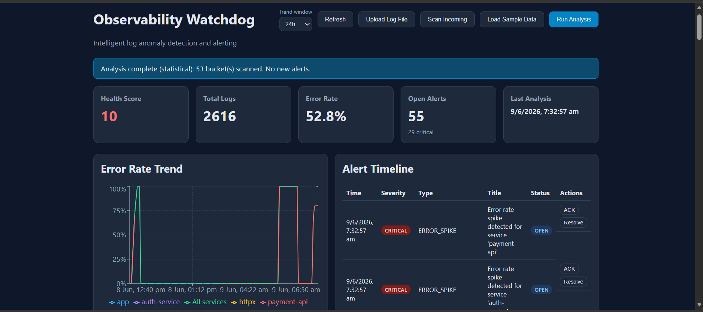

# Observability Watchdog

[](https://www.python.org/downloads/)
[](https://fastapi.tiangolo.com/)
[]()

**Intelligent Observability & Event Watchdog** — Python API-first SRE service that ingests logs, detects anomalies via **hybrid AI + statistical analysis**, triggers webhook alerts, and visualizes health trends.

> Meets **Wolters Kluwer GTS Assessment — Project 3**: AI-driven log anomaly detection, webhook alerting, and health trend dashboard.

**Repository:** https://github.com/soothsayervikas/observability-watchdog

### Vibe Coding Statement (Assessment Workflow)

This repository was built under the **Wolters Kluwer GTS “Vibe Coding”** rules: **I am the architect; the AI agent is the engineer.** All application code, tests, and documentation in this repo were produced through **Cursor** from my prompts — **no manual code edits** during implementation, per assessment requirements.

My role was to define architecture, review outputs, and iterate through targeted prompts (security hardening, hybrid AI detection, dashboard UX, CI, and edge-case fixes). The full audit trail of every instruction is in [`prompts.md`](prompts.md), starting with the assessment’s opening template.

This is an **assessment MVP** that demonstrates API-first SRE observability patterns (ingestion, hybrid detection, webhooks, dashboard). It is intentionally scoped for local/SQLite demo and reviewer evaluation — not a claim of full enterprise production deployment.

---

## Quick Start

```bash
cd observability-watchdog
python -m venv .venv && .venv\Scripts\activate    # Windows
pip install -e ".[dev]"
copy .env.example .env
copy .env.local.example .env.local                 # add Azure OpenAI key here only
uvicorn app.main:app --host 127.0.0.1 --port 8000
```

```bash
# Terminal 2 — webhook          Terminal 3 — dashboard
python scripts/mock_webhook.py   cd dashboard && npx vite --port 5173
```

Open **http://127.0.0.1:5173** → **Load Sample Data** → **Run Analysis**

API docs: http://127.0.0.1:8000/docs (local profile only — hidden in production)

> **Environment:** `.env.example` defaults to `APP_ENV=local` (relaxed security for development). See [Environment Profiles](#environment-profiles) to switch to production.

---

## Screenshot



*Health score, error trend chart, and alert timeline after Load Sample Data → Run Analysis.*

---

## Features

- **Log ingestion** — JSON API, file upload, watch directory, collector agent
- **Hybrid detection** — rolling baseline + z-score + Azure OpenAI (`gpt-4.1`) with result caching
- **Webhook alerts** — simulated delivery with retry, HMAC signing, and audit trail
- **Dashboard** — health score, error trends, alert timeline with **ACK / Resolve**, webhook delivery panel (React + TypeScript)
- **Observability** — Prometheus `/metrics` (normalized path labels), readiness probe (`/api/v1/health/ready`), request trace IDs in webhook payloads
- **Environment profiles** — `local` (relaxed) vs `production` (hardened) via `APP_ENV`
- **Production hardening** — API key auth, per-endpoint rate limiting, SSRF-safe webhooks (DNS pinning), body size limits, log retention
- **Concurrency-safe analysis** — single-flight guard (`409`); Redis distributed lock when `REDIS_URL` is set
- **SQL-side bucketing** — memory-efficient analysis without loading all log rows into Python
- **Production-style** — layered architecture, 71 pytest + 4 dashboard tests (~88% coverage), mypy, ruff, Docker full-stack
- **Deployment guide** — [`docs/DEPLOYMENT.md`](docs/DEPLOYMENT.md) (SQLite vs Postgres/Redis topologies)

## Tech Stack

Python 3.11 · FastAPI · SQLAlchemy · SQLite · Azure OpenAI · React · Vite · pytest · Docker

---

## Architecture

```
Dashboard / Upload / Collector  →  FastAPI API  →  Services  →  SQLite
                                        ↓
                              Statistical + Azure OpenAI
                                        ↓
                              Webhook + Dashboard metrics
```

**Detection pipeline:** Ingest → 5-min buckets → statistical spike detection → AI enrichment → deduplicated alerts → webhook → dashboard

Details: [`docs/ARCHITECTURE.md`](docs/ARCHITECTURE.md)

---

## Demo (recommended path)

1. Start API + mock webhook + dashboard (see [Quick Start](#quick-start))
2. Click **Load Sample Data** on dashboard (or `POST /api/v1/demo/seed`)
3. Click **Run Analysis**
4. Observe health score drop, error trend chart, and AI assessment banner
5. Use **ACK** / **Resolve** on alerts; review **Webhook Deliveries** panel
6. Check webhook terminal for alert payload (includes `trace_id`)

**Alternative:** Upload `data/incoming/sample-app.log` via Swagger `POST /api/v1/logs/upload`

More demo options: [`docs/INGESTION.md`](docs/INGESTION.md)

---

## Log Ingestion (summary)

| Method | How |
|--------|-----|
| API push | `POST /api/v1/logs/ingest` |
| File upload | `POST /api/v1/logs/upload` or dashboard button |
| Watch directory | Drop files in `data/incoming/` → `POST /api/v1/sources/scan` |
| Collector agent | `python scripts/log_collector.py --mode watch` |

Formats: `.json`, `.jsonl`, `.log`, `.txt` — see [`docs/INGESTION.md`](docs/INGESTION.md)

---

## API (summary)

| Endpoint | Description |
|----------|-------------|
| `GET /api/v1/health` | Liveness probe (public) |
| `GET /api/v1/health/ready` | Readiness probe — DB connectivity (public) |
| `GET /metrics` | Prometheus metrics (public) |
| `POST /api/v1/logs/ingest` | Batch ingest JSON |
| `POST /api/v1/logs/upload` | Upload log file |
| `POST /api/v1/logs/ingest/raw` | Ingest raw log text |
| `GET /api/v1/logs` | Query ingested logs |
| `POST /api/v1/analyze/run` | Run detection (409 if already in progress) |
| `GET /api/v1/health/summary` | Health score + KPIs (lookback window) |
| `GET /api/v1/alerts` | List alerts (filter by severity / status) |
| `PATCH /api/v1/alerts/{id}` | Update alert status (ACK / RESOLVED) |
| `GET /api/v1/metrics/trends` | Error trend data |
| `GET /api/v1/webhooks/deliveries` | Webhook audit trail (`?include_payload=true` optional) |

Full reference: [`docs/API.md`](docs/API.md) · Interactive: http://127.0.0.1:8000/docs

---

## Configuration

### Two-file setup (recommended)

| File | Committed? | Purpose |
|------|------------|---------|
| `.env` | Optional (use `.env.example` as template) | App settings, profiles, non-secret defaults |
| `.env.local` | **Never** — gitignored | Azure OpenAI credentials and other secrets |

```bash
copy .env.example .env
copy .env.local.example .env.local
# Edit .env.local — add your Azure OpenAI endpoint and key only there
```

```env
# .env — safe defaults
APP_ENV=local
WEBHOOK_URL=http://127.0.0.1:8765/webhook
LOG_RETENTION_DAYS=30          # set 0 to disable pruning
AI_CACHE_TTL_SECONDS=300       # skip duplicate Azure OpenAI calls within TTL
TRUSTED_PROXY=false

# .env.local — gitignored, overrides .env
AZURE_OPENAI_ENDPOINT=https://your-resource.services.ai.azure.com
AZURE_OPENAI_API_KEY=your-key-here
AZURE_OPENAI_DEPLOYMENT=gpt-4.1
```

> **Security:** Never put real API keys in `.env`, README, or committed files. If a key was ever pasted in chat or committed, **rotate it in Azure Portal** before pushing to GitHub. Run `make secrets` before your first public push.

Full list: [`docs/CONFIGURATION.md`](docs/CONFIGURATION.md) · Template: [`.env.local.example`](.env.local.example)

---

## Environment Profiles

The app supports two runtime profiles controlled by `APP_ENV` in `.env`:

| Profile | `APP_ENV` | Best for |
|---------|-----------|----------|
| **Local** (default) | `local` or `development` | Day-to-day dev, demos, assessment review |
| **Production** | `production` | Deployment-style runs with full hardening |

You can also override the profile explicitly:

| `SECURITY_PROFILE` | Effect |
|--------------------|--------|
| `auto` (default) | Follows `APP_ENV` — local = relaxed, production = strict |
| `relaxed` | Always local-style (even if `APP_ENV=production`) |
| `strict` | Always production-style (even if `APP_ENV=local`) |

### What changes per profile

| Control | Local / relaxed | Production / strict |
|---------|-----------------|---------------------|
| `/docs` + Swagger UI | Enabled | Disabled |
| `/api/v1/demo/seed` (Load Sample Data) | Enabled | Disabled |
| Rate limiting | Off | On — per-endpoint keys (120 ingest / 10 analyze / 300 default per min) |
| Upload & body size | 100 MB | 10 MB |
| Log message length | ~1 MB | 8 KB |
| Security headers | Off | On (`nosniff`, `DENY` frame, etc.) |
| Webhook HMAC signing | Off | On (required at startup) |
| API key auth | Off | On (required at startup) |
| `/health` response | Full config details | Minimal `{"status":"ok"}` only |
| SSRF webhook validation | Allows private hosts | DNS resolve + block private IPs |
| `X-Forwarded-For` for rate limits | Ignored | Honored only when `TRUSTED_PROXY=true` |

### Local development (default)

```bash
copy .env.example .env
copy .env.local.example .env.local   # Azure OpenAI key required for hybrid AI detection
```

```env
APP_ENV=local
SECURITY_PROFILE=auto
```

### Production-style run

Copy the production template or set variables manually:

```bash
copy .env.production.example .env
```

```env
APP_ENV=production
SECURITY_PROFILE=strict
API_KEY=replace-with-strong-random-api-key       # required — startup fails without this
WEBHOOK_HMAC_SECRET=your-strong-random-secret    # required — startup fails without this
TRUSTED_PROXY=false                              # set true only behind a reverse proxy
RATE_LIMIT_ENABLED=true
LOG_RETENTION_DAYS=30
AI_CACHE_TTL_SECONDS=300
LOG_MAX_UPLOAD_MB=10
LOG_MAX_MESSAGE_CHARS=8192
```

Run the mock webhook with HMAC verification (production):

```bash
# PowerShell
$env:WEBHOOK_HMAC_SECRET="your-strong-random-secret"
python scripts/mock_webhook.py
```

### Verify active profile

```bash
curl http://127.0.0.1:8000/api/v1/health
```

Example response (local):

```json
{
  "status": "ok",
  "environment": "local",
  "security_profile": "relaxed",
  "hardening_enabled": false
}
```

Example response (production — minimal liveness only):

```json
{
  "status": "ok"
}
```

Readiness (both profiles): `GET /api/v1/health/ready` → `{"status":"ready","database":true}`

> Restart the API after changing `APP_ENV` or `SECURITY_PROFILE`.

**Production API key:** Set `API_KEY` in `.env` when using `APP_ENV=production`. Clients must send `X-API-Key`. For the dashboard, set `VITE_API_KEY` at build time (same value). Local/relaxed mode works without a key.

More: [`docs/CONFIGURATION.md`](docs/CONFIGURATION.md) · [`.env.production.example`](.env.production.example)

---

## Project Structure

```
app/
  api/           # FastAPI routers and dependencies
  core/          # config helpers, metrics, SSRF safety, HTTP client, AI cache
  repositories/  # log, alert, metrics, webhook (split modules)
  services/      # ingestion, analysis, detection, webhooks
  middleware/    # auth, security headers, body limits
dashboard/       # React + TypeScript UI
data/            # incoming logs, samples, SQLite DB
scripts/         # collector, mock webhook, demo, ci_docker_smoke.py
tests/           # unit + integration (60 tests, ~87% coverage)
docs/            # architecture, API, configuration guides
prompts.md       # vibe-coding audit log
```

---

## Testing

```bash
make test          # pytest with coverage (~87%, 60 tests)
make lint          # ruff check + format
make typecheck     # mypy on core modules
make secrets       # scan tracked files for leaked API keys (run before git push)
make test-dashboard
cd dashboard && npm run build
```

**Strict profile** (full suite under production hardening):

```bash
# PowerShell
$env:APP_ENV="production"; $env:SECURITY_PROFILE="strict"
$env:API_KEY="test-key"; $env:WEBHOOK_HMAC_SECRET="test-secret"
$env:WEBHOOK_URL="http://1.2.3.4:8765/webhook"
pytest -q
```

**CI** (GitHub Actions): relaxed + strict full-suite pytest, dashboard build, Docker build, and `docker compose` smoke test via `scripts/ci_docker_smoke.py`.

## Docker

Full-stack image (API + built dashboard) with mock webhook receiver:

```bash
copy .env.example .env
docker compose up --build
```

| Service | URL |
|---------|-----|
| Dashboard + API | http://127.0.0.1:8000 |
| Prometheus metrics | http://127.0.0.1:8000/metrics |
| Mock webhook logs | `docker compose logs -f webhook` |

> Docker sets `SERVE_DASHBOARD=true` so the built React app is served from the API container. For local dev, use the Vite dev server on port 5173 instead.

**Smoke test** (API must be running):

```bash
python scripts/smoke_test.py          # local dev servers
python scripts/ci_docker_smoke.py     # after docker compose up
```

---

## Vibe Coding (Assessment Requirement)

Per the Wolters Kluwer brief, this project follows **Human-in-the-Loop / Agentic Orchestration**:

| Requirement | How this repo satisfies it |
|-------------|----------------------------|
| Python, API-first, free-tier DB | FastAPI + SQLite + REST API |
| AI logic for anomaly detection | Hybrid statistical + Azure OpenAI classifier |
| Simulated webhook + health dashboard | Mock receiver + React dashboard |
| **No manual code edits** | All logic and fixes via Cursor agent prompts |
| **Audit log** | Complete prompt history in [`prompts.md`](prompts.md) |
| **Opening prompt** | Assessment template — Turn 0 in `prompts.md` |
| Single AI tool end-to-end | Cursor only (architectural consistency) |

**What I owned as architect:** system design, technology choices, security profile model, demo flow, test/CI expectations, and prompt-driven remediation when bugs appeared.

**What the AI agent implemented:** code, tests, Docker/CI, docs, and fixes — always from my instructions.

Full workflow write-up: [`docs/VIBE_CODING.md`](docs/VIBE_CODING.md)

---

## Submission Checklist

| Item | Location |
|------|----------|
| Public GitHub repo | Update URL at top of this README |
| `prompts.md` | [`prompts.md`](prompts.md) |
| Architecture deck | [`docs/ARCHITECTURE.md`](docs/ARCHITECTURE.md) → export PDF/PPT |
| Tagle.ai Tag summary | https://tagle.ai |
| Tagle quiz | https://tagle.ai/quiz |
| Dashboard screenshot | [`docs/images/dashboard.png`](docs/images/README.md) |
| Cloud cleanup | Local SQLite only — no cloud resources |
| Secret scan before push | `make secrets` — no real keys in tracked files |

Full checklist (including post-review fixes): [`docs/SUBMISSION_CHECKLIST.md`](docs/SUBMISSION_CHECKLIST.md)

---

## Troubleshooting

| Problem | Fix |
|---------|-----|
| Upload `404` | Restart backend |
| No new alerts | Load fresh data (dedupe); run analysis again |
| AI fails | Set `AZURE_OPENAI_*` in `.env.local` (not `.env`); restart API |
| `API_KEY is required` on startup | Set `API_KEY` in `.env` when `APP_ENV=production`, or use `APP_ENV=local` |
| Webhook silent | Start `python scripts/mock_webhook.py` |
| Load Sample Data missing | Set `APP_ENV=local` — demo route disabled in production |
| `/docs` returns 404 | Set `APP_ENV=local` or `SECURITY_PROFILE=relaxed` |
| Rate limit `429` | Use local profile, or wait 60s / raise limits in `.env` |
| Analysis `409` already in progress | Wait for the current run to finish before retrying |
| Webhook `401` invalid signature | Match `WEBHOOK_HMAC_SECRET` on API and mock webhook |
| Port already in use | `netstat -ano \| findstr :8000` then `taskkill /PID <pid> /F` |
| `WEBHOOK_HMAC_SECRET is required` | Set in `.env` for production, or use `APP_ENV=local` |

More: [`docs/TROUBLESHOOTING.md`](docs/TROUBLESHOOTING.md)

---

## Documentation Index

| Document | Purpose |
|----------|---------|
| [`docs/ARCHITECTURE.md`](docs/ARCHITECTURE.md) | Architecture deck |
| [`docs/API.md`](docs/API.md) | Full API reference |
| [`docs/CONFIGURATION.md`](docs/CONFIGURATION.md) | Environment variables & profiles |
| [`.env.production.example`](.env.production.example) | Production `.env` template |
| [`docs/INGESTION.md`](docs/INGESTION.md) | Log ingestion guide |
| [`docs/VIBE_CODING.md`](docs/VIBE_CODING.md) | Vibe coding workflow |
| [`docs/DEPLOYMENT.md`](docs/DEPLOYMENT.md) | Production deployment (SQLite vs Postgres/Redis) |
| [`docs/TROUBLESHOOTING.md`](docs/TROUBLESHOOTING.md) | Common issues |
| [`prompts.md`](prompts.md) | AI prompt audit log |
| [`.env.local.example`](.env.local.example) | Local secrets template (Azure OpenAI) |
| [`docs/SUBMISSION_CHECKLIST.md`](docs/SUBMISSION_CHECKLIST.md) | Pre-push submission checklist |

---

## Author

**Vikas Mishra** — Senior GenAI / Platform Engineer

Built for Wolters Kluwer GTS Assessment (Project 3 — SRE Observability Watchdog).

---

## License

Built for assessment purposes. All rights reserved.
